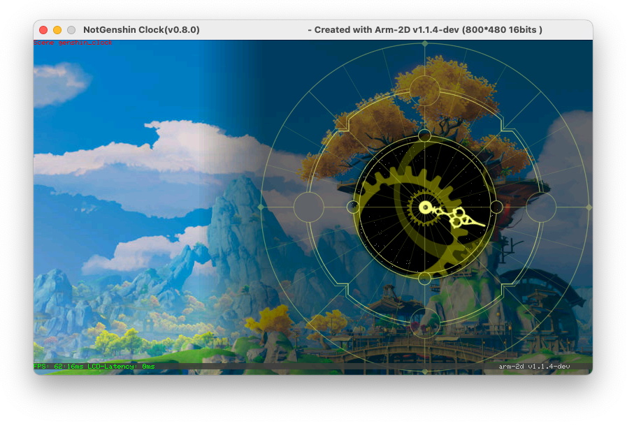
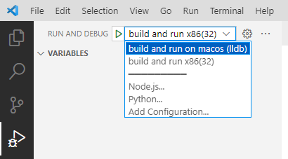

# NotGenshin Clock (v0.8.1)
This is a Genshin Impact-style clock face created with [arm-2d](https://github.com/ARM-software/Arm-2D). **You can use this project as a template for arm-2d development on PC (e.g. Windows, Linux and MacOS).**

 

### Disclaimer:

Apart from the background image, which is derived from a game screenshot, this open-source project does not directly utilize any resource files from Genshin Impact. All materials necessary for the clock face were created by myself, yet unavoidably reference the original design of Genshin Impact. The copyright for these designs belongs to the original game company. 

The image materials involved in this open-source project that is, the converted pixel array source code files (stored in the `genshin_clock/resources` directory), are **NOT** to be used for any commercial purposes and are solely for open-source and learning purposes. This rule supersedes the Apache 2.0 License that this project uses. 

The rest of the source code in this project adheres to the Apache 2.0 License.


## How to Build

This example project currently support Windows, Linux and MacOS. Please follow the corresponding guidance for your environment.

### 1 For Windows

#### 1.1 Clone the Repository

First, please clone the project to your local machine. You can do this by running the following command in your terminal:

```bash
git clone --recursive https://github.com/GorgonMeducer/NotGenshinClock.git
```

The `--recursive` option is used to clone all the submodules included in the project.

#### 1.2 Install GCC (mingw32) and Make

Second, please 

- download and install GCC. You **MUST** download the [latest mingw32](https://github.com/niXman/mingw-builds-binaries/releases/). For example, [i686-13.1.0-release-posix-dwarf-ucrt-rt_v11-rev1.7z](https://github.com/niXman/mingw-builds-binaries/releases/download/13.1.0-rt_v11-rev1/i686-13.1.0-release-posix-dwarf-ucrt-rt_v11-rev1.7z) Unzip the package and copy it to your desired location. 
- [download](https://gnuwin32.sourceforge.net/packages/make.htm) and install Make.

**NOTE**: Ensure you have correctly set the **PATH** variable in the Windows environment for GCC and Make. After installation, you may need to restart your computer to ensure the new environment variable settings take effect.

 


#### 1.3 Open the Project

Finally, please open the project in VS Code. You can do this by choosing "**Open Workspace from File**"  in the File menu in VS Code and then selecting the workspace file `NotGenshinClock.code-workspace` in the `NotGenshinClock` folder that you have just cloned.

In "**Run and Debug**" panel, you can run the project via "**build and run x86(32)**" or you can press "**F5**" to launch a debug session.

 


### 2 For Linux

#### 2.1 Clone the Repository

First, please clone the project to your local machine. You can do this by running the following command in your terminal:

```bash
git clone --recursive https://github.com/GorgonMeducer/NotGenshinClock.git
```

The `--recursive` option is used to clone all the submodules included in the project.


#### 2.2 Install the required components

Second, please install the required modules with the following command:

```sh
sudo apt-get update && sudo apt-get install -y build-essential libsdl2-dev
```


#### 2.3 Open the Project

Finally, please open the project in VS Code. You can do this by choosing "**Open Workspace from File**"  in the File menu in VS Code and then selecting the workspace file `NotGenshinClock.code-workspace` in the `NotGenshinClock` folder that you have just cloned.

In "**Run and Debug**" panel, you can run the project via "**build and run x86(32)**" or you can press "**F5**" to launch a debug session.

 


### 3 For MacOS

#### 3.1 Clone the Repository

First, please clone the project to your local machine. You can do this by running the following command in your terminal:

```bash
git clone --recursive https://github.com/GorgonMeducer/NotGenshinClock.git
```

The `--recursive` option is used to clone all the submodules included in the project.


#### 3.2 Install the homebrew and sdl2

Second, please open the terminal in MacOS and [install the homebrew](https://brew.sh/) with the following command:

```sh
/bin/bash -c "$(curl -fsSL https://raw.githubusercontent.com/Homebrew/install/HEAD/install.sh)"
```

After a successful installation, you should find an important message on the terminal that is similar to the following:


Please copy the part in the red box and paste to the shell to "**add Howbrew to your PATH**". 

**NOTE**: Your command line will be different from mine as it contains the user name of the machine. 


After that, please install sdl2 with the following command:

```sh
brew install sdl2
```


#### 3.3 Open the Project

Finally, please open the project in VS Code. You can do this by choosing "**Open Workspace from File**"  in the File menu in VS Code and then selecting the workspace file `NotGenshinClock.code-workspace` in the `NotGenshinClock` folder that you have just cloned.

In "**Run and Debug**" panel, you can run the project via "**build and run on macos (lldb)**" or you can press "**F5**" to launch a debug session.

 


Now, you should be ready to start using the `NotGenshinClock` project. If you encounter any issues, feel free to ask for help.

Enjoy.
